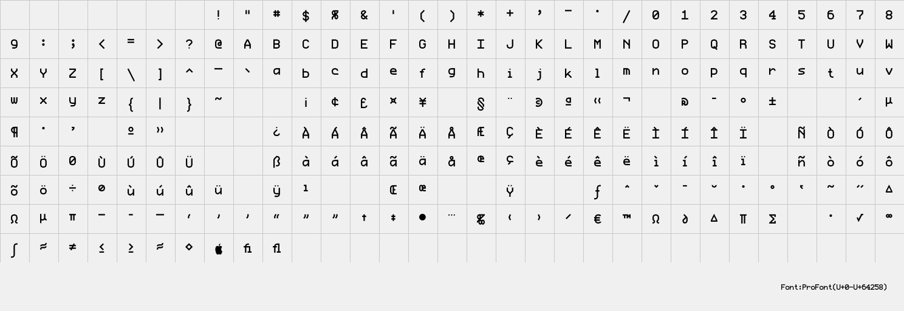

# struetype.h

Fork of the stb_truetype.h v1.26 font header originally from
https://github.com/nothings/stb

Here's an example of struetype.h output produced with the ProFont ttf:

This fork makes API changes to address the 2020/2022 CVE reports, which are
considered out of scope by upstream. The specific CVE reports in question are:

* [CVE-2022-25516](https://nvd.nist.gov/vuln/detail/CVE-2022-25516)
* [CVE-2022-25515](https://nvd.nist.gov/vuln/detail/CVE-2022-25515)
* [CVE-2022-25514](https://nvd.nist.gov/vuln/detail/CVE-2022-25514)
* [CVE-2020-6623](https://nvd.nist.gov/vuln/detail/CVE-2020-6623)
* [CVE-2020-6622](https://nvd.nist.gov/vuln/detail/CVE-2020-6622)
* [CVE-2020-6621](https://nvd.nist.gov/vuln/detail/CVE-2020-6621)
* [CVE-2020-6620](https://nvd.nist.gov/vuln/detail/CVE-2020-6620)
* [CVE-2020-6619](https://nvd.nist.gov/vuln/detail/CVE-2020-6619)
* [CVE-2020-6618](https://nvd.nist.gov/vuln/detail/CVE-2020-6618)
* [CVE-2020-6617](https://nvd.nist.gov/vuln/detail/CVE-2020-6617)

The test cases in the reports are set up to be runnable with make test,
ensuring we can reproduce and test the failure cases.  The code and files are
from https://github.com/Vincebye Github issues associated with these CVEs.

The API changes are (and must be) breaking, since addressing the problems
requires knowledge about buffer sizes the original APIs don't provide.
Accordingly, we have renamed the header and changed the function names to
use a different prefix.

The foview example will take a .ttf file and produce a PDF (and a PNG if
the character set is small enough, which it usually isn't on modern fonts)
visualizing the glyphs defined by the font.
